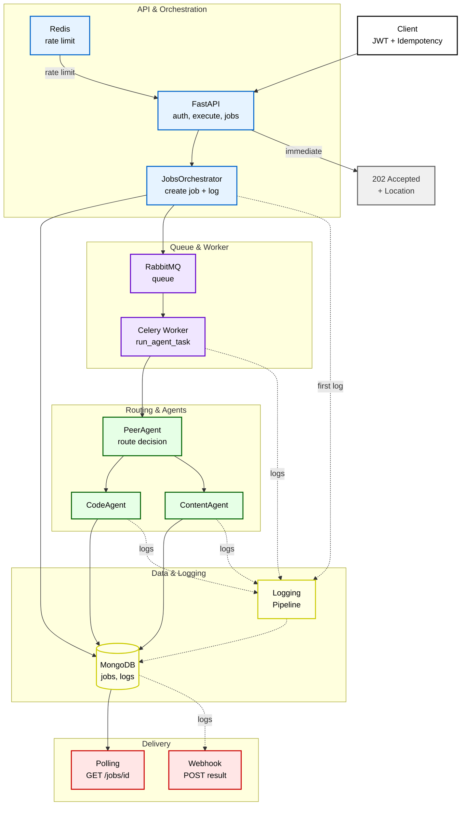

# Agentic API

## Description
Agentic API is a sophisticated, asynchronous AI agent system built with FastAPI that intelligently routes and processes tasks between specialized agents. The system automatically determines whether a task requires code generation or content research, then orchestrates the execution through a robust queue-based architecture with comprehensive logging and monitoring.

## Features
- 🤖 **Intelligent Agent Routing**: PeerAgent automatically determines the best agent (Code vs Content) for each task
- 🔄 **Asynchronous Processing**: Celery workers with RabbitMQ for scalable, non-blocking task execution
- 📝 **Code Generation**: Structured code output with language detection and explanations
- 🔍 **Content Research**: Web-based content aggregation with whitelist validation and source normalization
- 🔐 **Enterprise Security**: JWT authentication, rate limiting, and idempotency controls
- 📊 **Comprehensive Logging**: End-to-end request tracking with MongoDB-based log events
- 🚀 **Scalable Architecture**: Horizontally scalable API and worker nodes
- 🔄 **Idempotency**: Prevents duplicate task execution with intelligent hash-based detection
- 🌐 **RESTful API**: Clean, documented endpoints with proper HTTP status codes
- 📈 **Real-time Progress**: Job status tracking with progress indicators and detailed error reporting

## Technologies
- **Backend Framework**: FastAPI (Python 3.8+)
- **Task Queue**: Celery with RabbitMQ
- **Primary Database**: MongoDB (jobs, log_events)
- **Secondary Database**: PostgreSQL (optional, Celery results)
- **Message Broker**: RabbitMQ
- **Caching & Rate Limiting**: Redis
- **Authentication**: JWT
- **AI/LLM**: OpenAI API
- **Containerization**: Docker & Docker Compose
- **Task Orchestration**: Custom JobsOrchestrator
- **Agent System**: PeerAgent, CodeAgent, ContentAgent

## LLM Model Selection Strategy

The system uses different LLM models for each agent type, optimized for their specific roles. Model names are configured via environment variables:

- `LLM_MODEL_ROUTER` - For PeerAgent routing decisions
- `LLM_MODEL_CONTENT` - For ContentAgent research and content generation
- `LLM_MODEL_CODE` - For CodeAgent code generation

### Model Selection Rationale

**Router (PeerAgent)**: **Fast & Cost-Effective**
- **Model**: "Mini" class chat model (e.g., `gpt-4o-mini` equivalent)
- **Why**: Only handles routing decisions with short prompts
- **Parameters**: `temperature≈0.0–0.2`, `max_tokens≈64`
- **Goal**: Low latency, minimal cost for simple classification tasks

**ContentAgent**: **Quality & Accuracy**
- **Model**: "Mid-to-high" quality general model (e.g., `gpt-4o` equivalent)
- **Why**: Fluent responses with source integration and factual accuracy
- **Parameters**: `temperature≈0.3–0.5`, `max_tokens` based on task size
- **Goal**: High-quality content with proper source attribution

**CodeAgent**: **Code-Centric Capability**
- **Model**: Code-focused powerful model (e.g., **code-specialized** variants)
- **Why**: Correct syntax, longer context handling, code generation expertise
- **Parameters**: `temperature≈0.2–0.3`, `presence_penalty=0`, `top_p≈0.9`
- **Goal**: Accurate, well-structured code output with explanations

### Why This Separation?

- **Cost Efficiency**: Using expensive models for simple routing tasks is wasteful
- **Specialized Performance**: Content and code generation require different strengths; independent model selection improves quality
- **Flexibility**: All models configurable via environment variables → supports cloud/hybrid/on-premise model deployments

## System Architecture

For visual representations of the system architecture and sequence flows, please refer to the following diagrams:
- [System Architecture Diagram](docs/images/system_architecture.png)
- [Execute Sequence Diagram](docs/images/sequence_execute.png)
- [Polling Sequence Diagram](docs/images/sequence_polling.png)

Based on the system architecture image, here's the Mermaid representation showing the complete flow from client request to result delivery.
**Why Mermaid?** We chose Mermaid for its text-based format, making it easy to update, version control, and maintain. Changes can be made directly in the code, ensuring the documentation stays synchronized with the codebase.




### Logging Strategy and Architectural Decisions

**MongoDB-based Logging**: We chose MongoDB for logging due to its flexible schema, excellent write performance, and natural fit for event-driven architectures. The `log_events` collection captures every critical step of the task lifecycle, enabling comprehensive debugging and monitoring.

**Event-Driven Logging**: Each significant operation (request received, agent decision, execution start/finish, progress updates) generates structured log events. This approach provides:
- Complete request traceability
- Performance bottleneck identification
- Error root cause analysis
- Operational insights and metrics

**Decoupled Logging**: Logs are written asynchronously without blocking the main execution flow, ensuring high performance while maintaining comprehensive observability.


## How to Setup

### Prerequisites
- Python 3.10+
- Docker & Docker Compose
- MongoDB instance
- RabbitMQ instance
- Redis instance
- OpenAI API key
- SERPAPI API KEY

### Docker Setup (Local)
For detailed Docker setup instructions, please refer to our [Docker Setup Guide](docs/docker_setup.md).


### Production Considerations
- Horizontal scaling for both API and worker nodes
- MongoDB replica set for high availability
- RabbitMQ clustering for message broker redundancy
- Redis cluster for distributed rate limiting
- Proper monitoring and alerting setup

## API Usage
For comprehensive API documentation and usage examples, please refer to our [API Usage Guide](docs/api-usage.md).

### Quick Start
```bash
# Execute a task
POST /api/v1/agent/execute
Authorization: Bearer <jwt_token>
Idempotency-Key: <unique_key>
Content-Type: application/json

{
  "task": "Create a Python function to calculate fibonacci numbers"
}

# Check job status
GET /api/v1/agent/jobs/{job_id}
Authorization: Bearer <jwt_token>
```

## Remaining Tasks
- [ ] Implement comprehensive test coverage
- [ ] Add more specialized agents (Data Analysis, Translation, etc.)
- [ ] Create CI/CD pipelines with automated testing
- [ ] Add performance benchmarks and load testing
- [ ] Add advanced monitoring with Prometheus & Grafana
- [ ] Implement webhook system for external integrations
- [ ] Add agent performance analytics and optimization
- [ ] Implement production deployment guide
- [ ] Add query parameters support for jobs listing endpoint (status, agent, limit, offset filtering)

## Contributing
We welcome contributions! Please feel free to submit a Pull Request. For major changes, please open an issue first to discuss what you would like to change.

## License
This project is licensed under the MIT License - see the LICENSE file for details.
